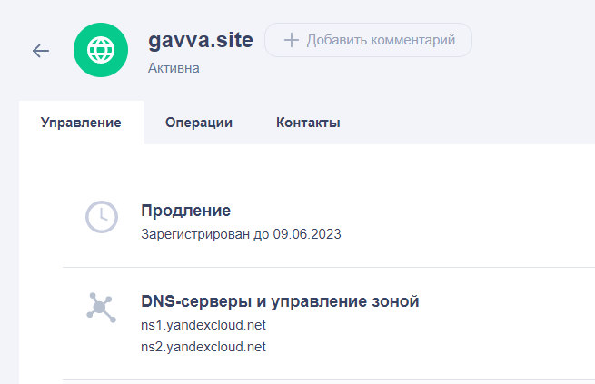
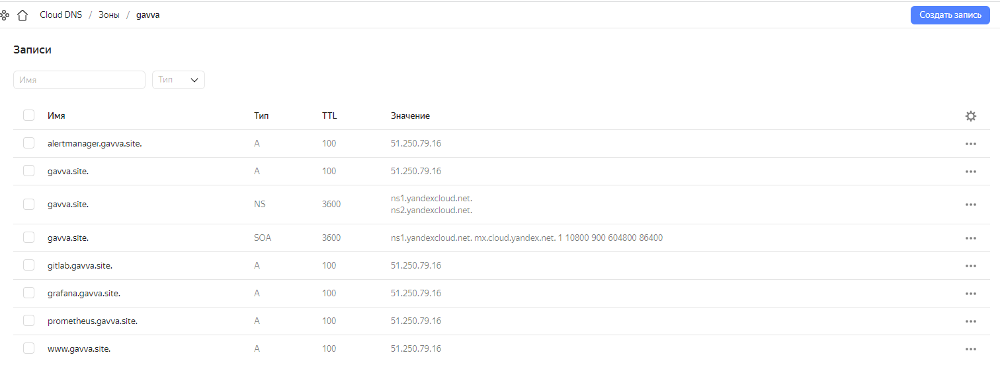
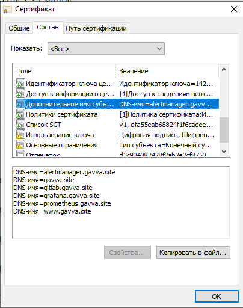
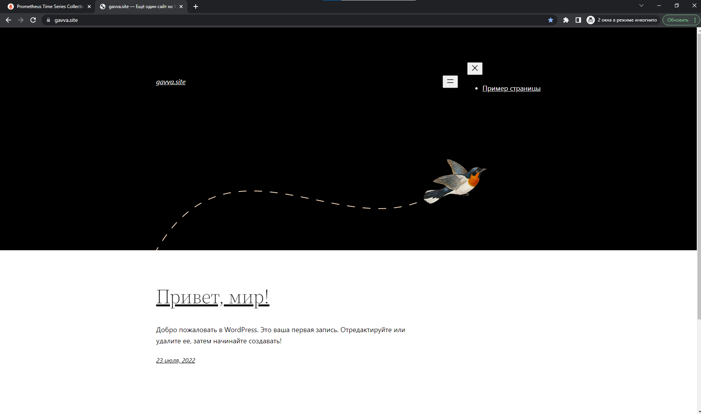
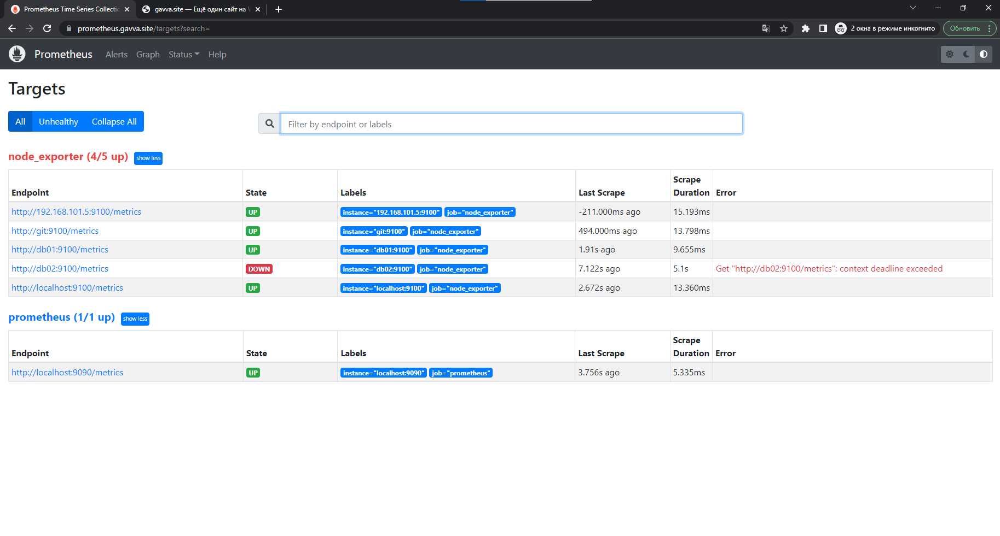
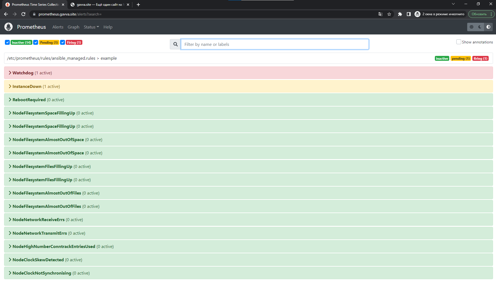
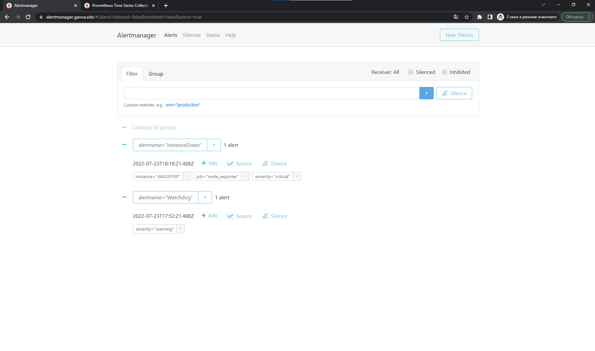
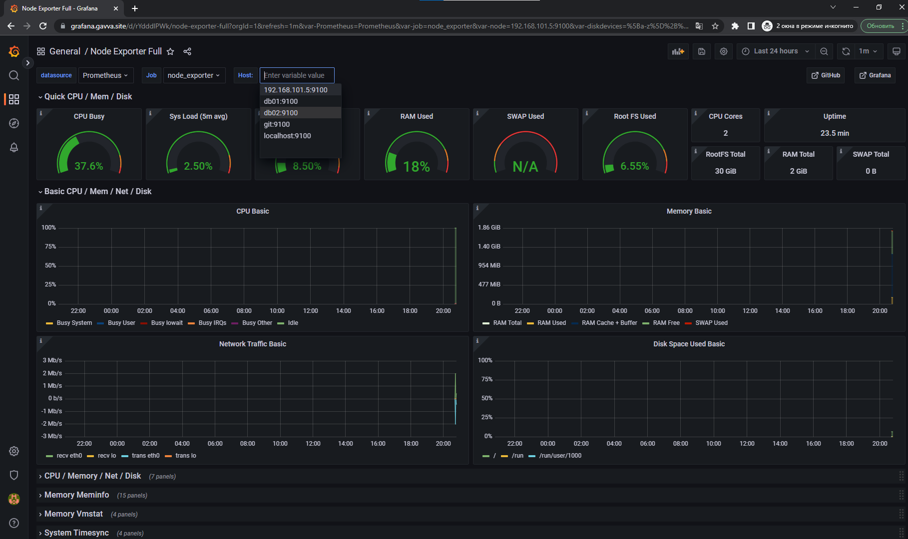

# Дипломное задание по курсу «DevOps-инженер»
## Этапы выполнения:

### 1. Регистрация доменного имени

Зарегистрирован домен gavva.site


### 2. Создание инфраструктуры
Описание инфраструктуры как код создано и выложено в git репозиторий
### 3. Установка Nginx и LetsEncrypt
1. Настроены все A-записи на внешний адрес этого сервера:

2. Настроены все upstream для выше указанных URL
3. При разворачивании инфраструктуры автоматически создается сертификат:

### 4. Установка кластера MySQL
1. MySQL работает в режиме репликации Master/Slave.
2. В кластере автоматически создаётся база данных c именем wordpress.
```bash
mysql> show replica status \G;
*************************** 1. row ***************************
             Replica_IO_State: Waiting for source to send event
                  Source_Host: db01.gavva.site
                  Source_User: repl
                  Source_Port: 3306
                Connect_Retry: 60
              Source_Log_File: mysql-bin.000002
          Read_Source_Log_Pos: 548903
               Relay_Log_File: db02-relay-bin.000005
                Relay_Log_Pos: 549119
        Relay_Source_Log_File: mysql-bin.000002
           Replica_IO_Running: Yes
          Replica_SQL_Running: Yes
              Replicate_Do_DB:
          Replicate_Ignore_DB:
           Replicate_Do_Table:
       Replicate_Ignore_Table:
      Replicate_Wild_Do_Table:
  Replicate_Wild_Ignore_Table:
                   Last_Errno: 0
                   Last_Error:
                 Skip_Counter: 0
          Exec_Source_Log_Pos: 548903
              Relay_Log_Space: 549497
              Until_Condition: None
               Until_Log_File:
                Until_Log_Pos: 0
           Source_SSL_Allowed: No
           Source_SSL_CA_File:
           Source_SSL_CA_Path:
              Source_SSL_Cert:
            Source_SSL_Cipher:
               Source_SSL_Key:
        Seconds_Behind_Source: 0
Source_SSL_Verify_Server_Cert: No
                Last_IO_Errno: 0
                Last_IO_Error:
               Last_SQL_Errno: 0
               Last_SQL_Error:
  Replicate_Ignore_Server_Ids:
             Source_Server_Id: 1
                  Source_UUID: 1b93d15e-0aae-11ed-83d7-d00d6145a327
             Source_Info_File: mysql.slave_master_info
                    SQL_Delay: 0
          SQL_Remaining_Delay: NULL
    Replica_SQL_Running_State: Replica has read all relay log; waiting for more updates
           Source_Retry_Count: 86400
                  Source_Bind:
      Last_IO_Error_Timestamp:
     Last_SQL_Error_Timestamp:
               Source_SSL_Crl:
           Source_SSL_Crlpath:
           Retrieved_Gtid_Set:
            Executed_Gtid_Set:
                Auto_Position: 0
         Replicate_Rewrite_DB:
                 Channel_Name:
           Source_TLS_Version:
       Source_public_key_path:
        Get_Source_public_key: 0
            Network_Namespace:
1 row in set (0.00 sec)

ERROR:
No query specified

mysql>
```
### 5. Установка WordPress

### 6. Установка Gitlab CE и Gitlab Runner

###  7. Установка Prometheus, Alert Manager, Node Exporter и Grafana
1. На всех серверах установлен Node Exporter и его метрики доступны Prometheus

2. У Alert Manager есть необходимый набор правил для создания алертов.


3. В Grafana есть дашборд отображающий метрики из Node Exporter по всем серверам.
